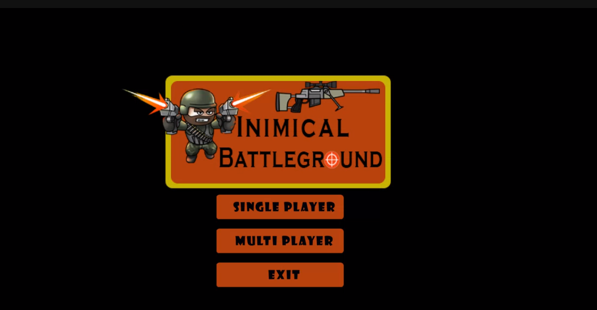
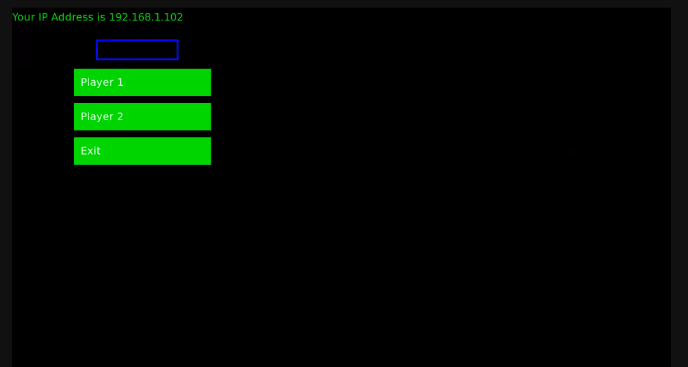
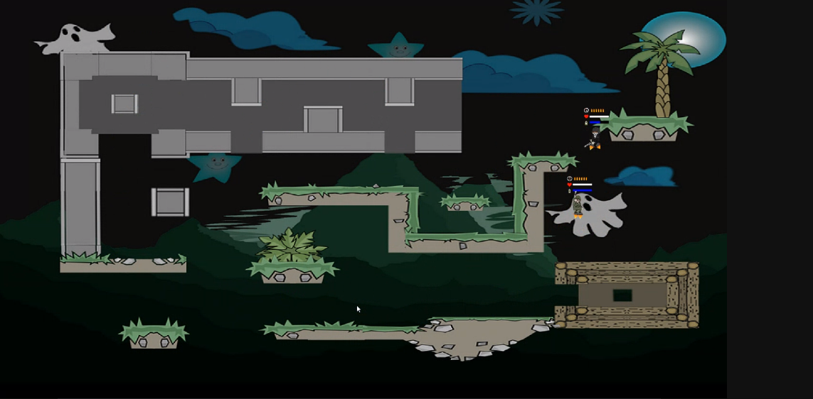
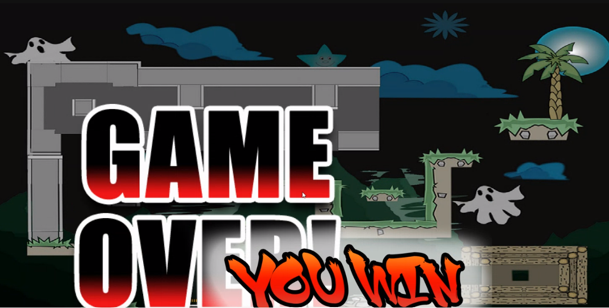

# InimicalBattlegrounds-2
___
## Introduction
Inimical battleground is a 2D platform shooting game, developed using C++ with SFML. \
Supports: Single Player and Multiplayer. \
Practical application of DSA
- Graph Generation Algorithm
- A* Algorithm
- Finite State Machine
- Singleton Design Pattern
___
## What's New?
- Single Player Mode added
- Main Menu Bug Fixed
- Sounds added
- Cleaner Codebase
___
### Building The Project
- Clone or Download the repositaries in your local machine.
- Download and install SFML  https://www.sfml-dev.org/download/sfml/2.5.1/
- Properly configure SFML https://www.sfml-dev.org/tutorials/2.5/start-vc.php
- Additional include directories: ./include
- Additional source directories: ./src \

Note: Copy pic and AudioAssets folder where the exe file is.

***
### Team Members
- Bishad Koju (075BCT025)
- Gaurav Jyakhwa (075BCT037)
- Kriti Nyoupane (075BCT043)

 \
 \
 \
 
